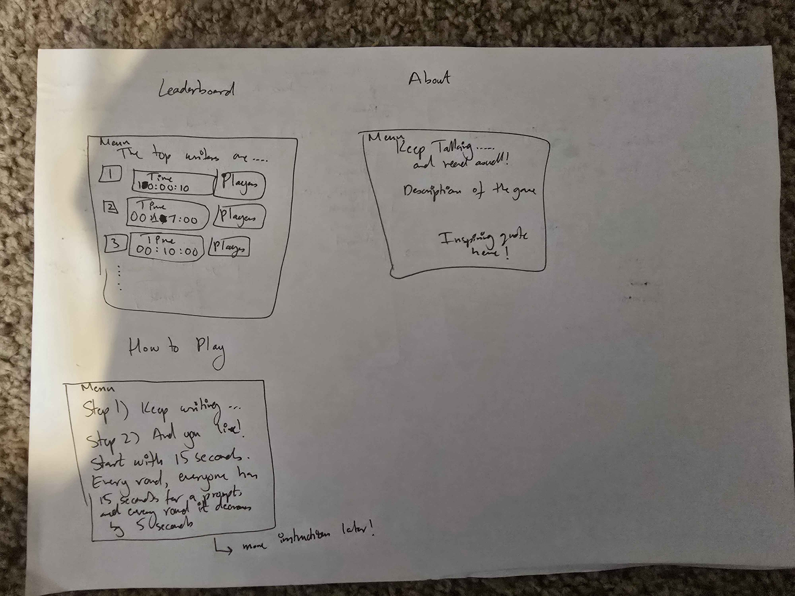

# Keep Typing and the Story Continues!

[My Notes](notes.md)

This web application is an adaptation of the popular elementary game of "Once upon a time..." but with the implementation of a 6-player game room. The application uses a timer to make the game competitive, and the last one standing is the victor.

## 🚀 Specification Deliverable

For this deliverable I did the following. I checked the box `[x]` and added a description for things I completed.

- [X] Proper use of Markdown - Cloned the repository from Simon, understood how it worked, and implemented it
- [X] A concise and compelling elevator pitch - Added some informal humor into the pitch, made it not too long, and used a call to action for the pitch to sound great.
- [X] Description of key features - Extracted the key features of my web application from the images and the pitch, and added them in.
- [X] Description of how you will use each technology - Read up on what the technologies do to the best of my current ability and linked features to technologies.
- [X] One or more rough sketches of your application. Images must be embedded in this file using Markdown image references. - Created a folder for images, and used Markdown image reference to put it inside my startup deliverable.

### Elevator pitch

Have you ever wondered who the most quick-witted person is in your friend group? Maybe you've tested that out in the playground, where each person continues the story you've started out with until it went from Antarctica to Narnia? This Keep Typing and the Story Continues! application lets you join a 6-player game where all players, in turn, attempt to continue the story while a timer ticks down. Once the timer reaches zero? Boom! You're out of the game. Channel your inner James Bond, and become the 007 of the writing world (at least, in your friend group!)

### Design

### Key features

- Secure login over HTTPS.
- The capability to play with 5 other unique players.
- Once the game concludes, an option to press a "Narrate!" button which will play Text-to-Speech for the end user using ElevenLabs.
- Games are persistently stored.
- A leaderboard to show the longest game, and who played in it.
- The prompts written by players displayed in real-time.
- A scrollbar for the story so far

### Technologies

I am going to use the required technologies in the following ways.

- **HTML** - Six HTML pages: Login, How to Play, About, the game being played, the page after the game completes that has a Narrate! button, and the leaderboard. I may cut this down if some pages become redundant, such as folding the How to Play page into the About page.
- **CSS** - The aesthetics of the pages. Right now, I plan to implement a soft blue color persistently in the background using CSS styling. It will have good contrast with the rest of the page aesthetics, and needs to be able to fit both PC and mobile layouts.
- **React** - This is the frontend. Handles logic for Login, submitting an entry, the timer buzzing down, appending onto the string so that the story is updated in real-time
- **Service** - The backend for React. It will handle the actual login and entry submission so that the frontend and the backend both work together.
- **DB/Login** - This will store the player signups and logins, the longest games played as well as who played in them. This website cannot be used without this database authenticating the user's credentials
- **WebSocket** - Updates the current story so far in real-time. Also updates who the current player is during each timer countdown.

## 🚀 AWS deliverable

For this deliverable I did the following. I checked the box `[x]` and added a description for things I completed.

- [ ] **Server deployed and accessible with custom domain name** - [My server link](https://yourdomainnamehere.click).

## 🚀 HTML deliverable

For this deliverable I did the following. I checked the box `[x]` and added a description for things I completed.

- [ ] **HTML pages** - I did not complete this part of the deliverable.
- [ ] **Proper HTML element usage** - I did not complete this part of the deliverable.
- [ ] **Links** - I did not complete this part of the deliverable.
- [ ] **Text** - I did not complete this part of the deliverable.
- [ ] **3rd party API placeholder** - I did not complete this part of the deliverable.
- [ ] **Images** - I did not complete this part of the deliverable.
- [ ] **Login placeholder** - I did not complete this part of the deliverable.
- [ ] **DB data placeholder** - I did not complete this part of the deliverable.
- [ ] **WebSocket placeholder** - I did not complete this part of the deliverable.

## 🚀 CSS deliverable

For this deliverable I did the following. I checked the box `[x]` and added a description for things I completed.

- [ ] **Visually appealing colors and layout. No overflowing elements.** - I did not complete this part of the deliverable.
- [ ] **Use of a CSS framework** - I did not complete this part of the deliverable.
- [ ] **All visual elements styled using CSS** - I did not complete this part of the deliverable.
- [ ] **Responsive to window resizing using flexbox and/or grid display** - I did not complete this part of the deliverable.
- [ ] **Use of a imported font** - I did not complete this part of the deliverable.
- [ ] **Use of different types of selectors including element, class, ID, and pseudo selectors** - I did not complete this part of the deliverable.

## 🚀 React part 1: Routing deliverable

For this deliverable I did the following. I checked the box `[x]` and added a description for things I completed.

- [ ] **Bundled using Vite** - I did not complete this part of the deliverable.
- [ ] **Components** - I did not complete this part of the deliverable.
- [ ] **Router** - I did not complete this part of the deliverable.

## 🚀 React part 2: Reactivity deliverable

For this deliverable I did the following. I checked the box `[x]` and added a description for things I completed.

- [ ] **All functionality implemented or mocked out** - I did not complete this part of the deliverable.
- [ ] **Hooks** - I did not complete this part of the deliverable.

## 🚀 Service deliverable

For this deliverable I did the following. I checked the box `[x]` and added a description for things I completed.

- [ ] **Node.js/Express HTTP service** - I did not complete this part of the deliverable.
- [ ] **Static middleware for frontend** - I did not complete this part of the deliverable.
- [ ] **Calls to third party endpoints** - I did not complete this part of the deliverable.
- [ ] **Backend service endpoints** - I did not complete this part of the deliverable.
- [ ] **Frontend calls service endpoints** - I did not complete this part of the deliverable.
- [ ] **Supports registration, login, logout, and restricted endpoint** - I did not complete this part of the deliverable.

## 🚀 DB deliverable

For this deliverable I did the following. I checked the box `[x]` and added a description for things I completed.

- [ ] **Stores data in MongoDB** - I did not complete this part of the deliverable.
- [ ] **Stores credentials in MongoDB** - I did not complete this part of the deliverable.

## 🚀 WebSocket deliverable

For this deliverable I did the following. I checked the box `[x]` and added a description for things I completed.

- [ ] **Backend listens for WebSocket connection** - I did not complete this part of the deliverable.
- [ ] **Frontend makes WebSocket connection** - I did not complete this part of the deliverable.
- [ ] **Data sent over WebSocket connection** - I did not complete this part of the deliverable.
- [ ] **WebSocket data displayed** - I did not complete this part of the deliverable.
- [ ] **Application is fully functional** - I did not complete this part of the deliverable.
